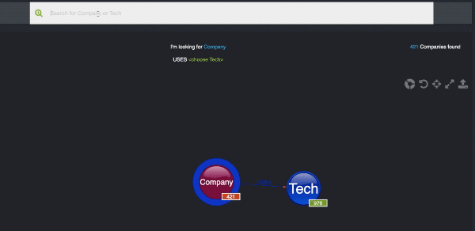

# Tech stack demand
A tool to visualize the tech stack demand on the current job market.

#### Show who is using certain technologies:

#### Search for company:

## Installation
* Run `docker-compose up`
* Open in your browser `http://localhost:5000/`
* Collect new data (reload page to see progress; this can take up to 20 min)

## How to use the UI
Check out this [basic action wiki](https://github.com/Nhogs/popoto/wiki/Basic-action).

## Technical sidenotes
Run tests:
`docker-compose -f docker-compose-tests.yml up`

Run keywords api update:
* delete old data saved in `keywords_api/redis_data`
* Run: `docker-compose -f docker-compose-keywords-update.yml up`
